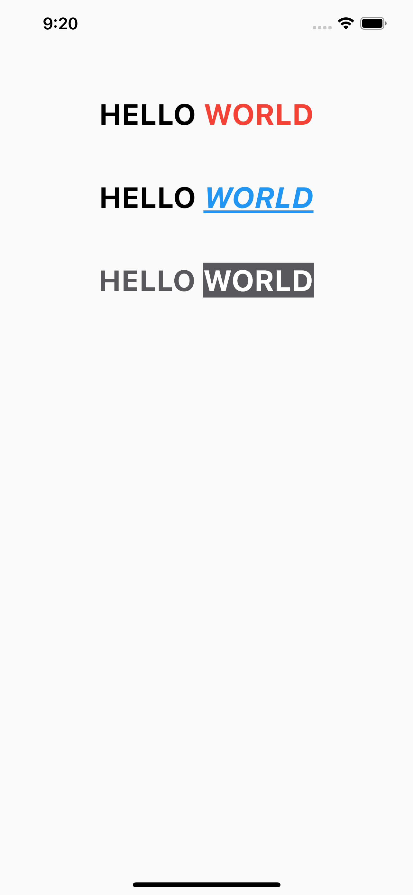
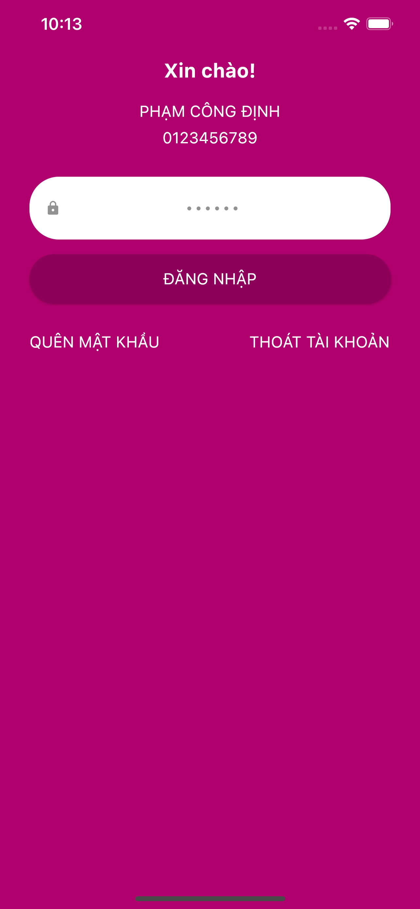
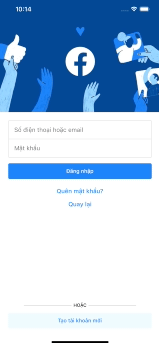
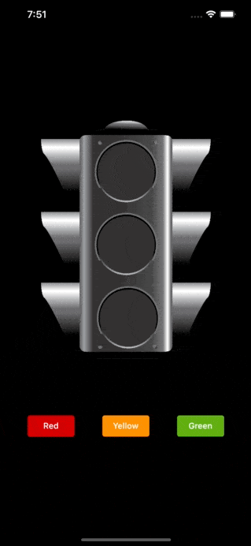
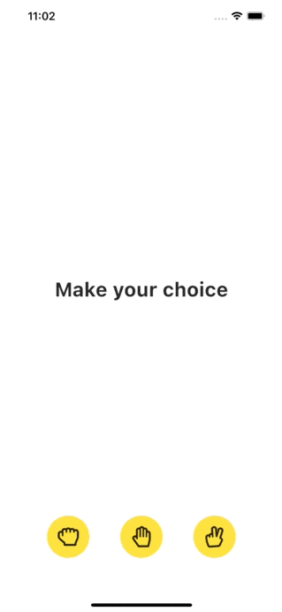
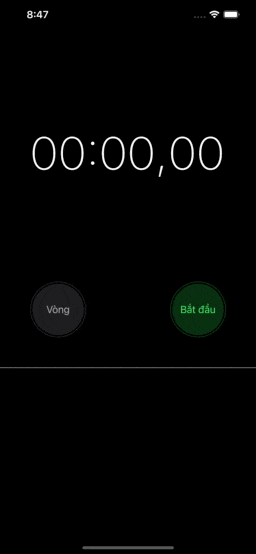
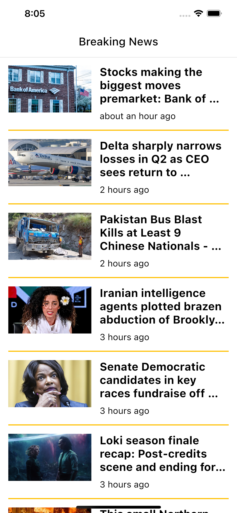
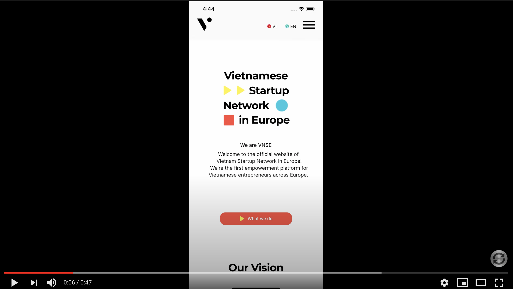

# Flutter examples

Learn Flutter by easy-to-difficult examples.

Official document: https://flutter.dev/docs.

# Reference

This project is based on [react-native-expo-examples](https://github.com/robinhuy/react-native-expo-examples) created by [Robin Huy](https://github.com/robinhuy). Thank you!

## Run project in development

- Setting up the development environment: https://flutter.dev/docs/get-started/install.

- Install dependencies: cd to project folder and run `flutter pub get`.

### Run the app
+ For Vscode users: https://flutter.dev/docs/get-started/test-drive?tab=vscode.
+ For Android Studio or IntelliJ users: https://flutter.dev/docs/get-started/test-drive?tab=androidstudio.
+ For terminal: https://flutter.dev/docs/get-started/test-drive?tab=terminal

## Preview
### 1. Hello World

Learn how to use: **ThemeData**, **Scaffold**, **Center**, **Text**, **SafeArea**, **Align**, **Column**, **RichText**, **TextSpan**, **WidgetSpan**, **SizedBox**, **Container**, and some style classes.

 

### 2. Login Screen

Learn how to use: **GestureDetector**, **FocusScope**, **AnnotatedRegion**, **TextField**, **Row**, **Enum**, **MediaQuery**, **Image**, **Animation**, **ElevatedButton**, **TextEditingController**, **FocusNode**, **StatefulWidget** and some widget lifecycle (**initState**, **dispose**) with event handler.

 

### 3. The Light
Learn how to use: **Platform**, **Switch**, **Cupertino Widget and Material Widget**, **Transform** and more about **StatefulWidget**.

 

### 3. Register Form
Learn how to use: **AppBar**, **Form**, **GlobalKey**, **TextFormField**, **showDialog method and AlertDialog Widget**, **Navigator**, **AnimatedPadding** and **JsonCodec** in **dart:convert**.

### 4. Instagram Feed
Learn how to use: **More about AppBar**, **BottomNavigationBar**, **BottomNavigationBarItem**, **ListView and ListView builder**, **LinearGradient**, **CircleAvatar**, **ClipOval**, **Stack**, **Positioned**, **LayoutBuilder**, **TextPainter**, some external libraries and how to declare data model.

### 4. Rock Paper Scissors
Learn how to use: **More about Animation**.

### 5. Stopwatch
Learn how to use: **Provider pattern for state management**, **ChangeNotifier, ChangeNotifierProvider and notifyListeners** , **FontFeature**, **Expanded**, **FittedBox**, **ListTile**, **CupertinoButton**, **Timer**.

### 6. Worldwide News
Learn how to use: **Clean architecture and bloc pattern in Flutter**, **FadeInImage**, **Infinite scroll with ListView** and some external packages like retrofit, flutter_bloc, get_it, equatable, lint, url_launcher, ... .

### 7. VNSE demo
Learn how to use: **Carousel package**, **Dotted packge**, **Launcher icon and splash screen**, **More practice with Stack and Positioned**, **Multiple scroll direction with SingleChildScrollView**.

Special thanks to [linhkhanh.osbkl](https://www.facebook.com/linhkhanh.osbkl) for this beautiful UI/UX design!

## More examples coming soon!